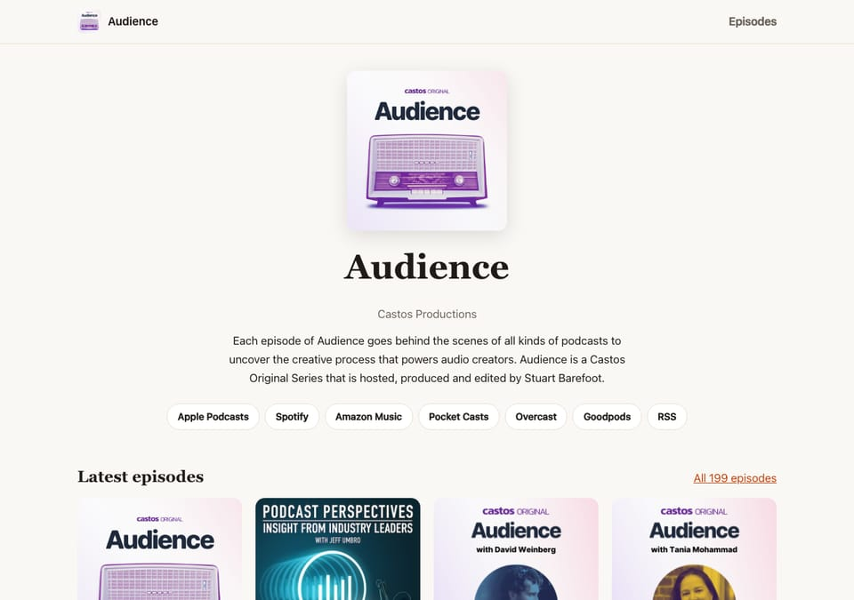
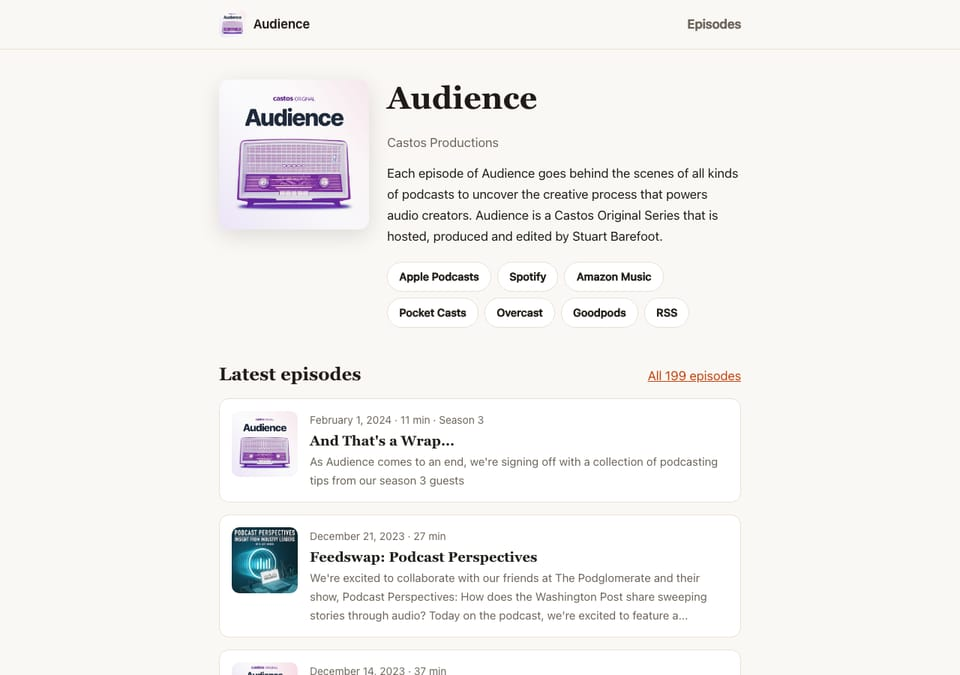
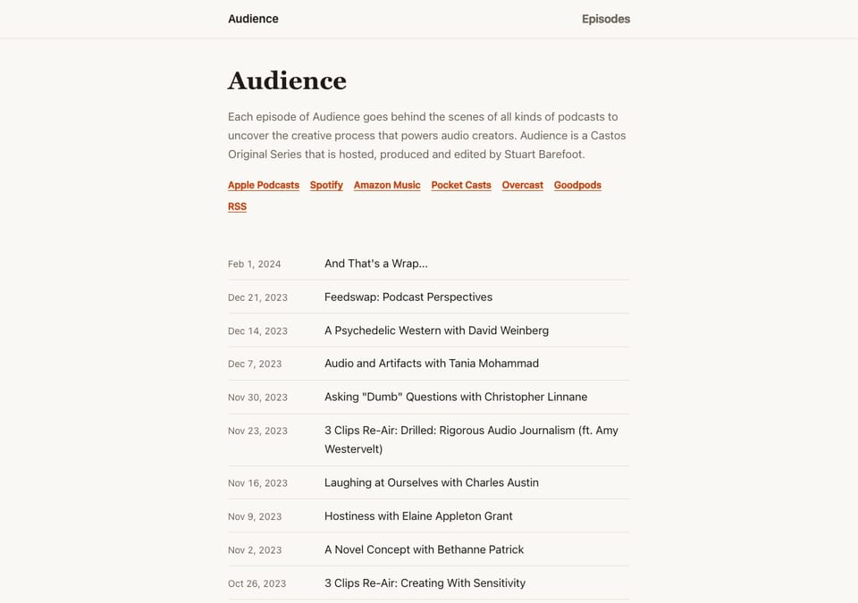
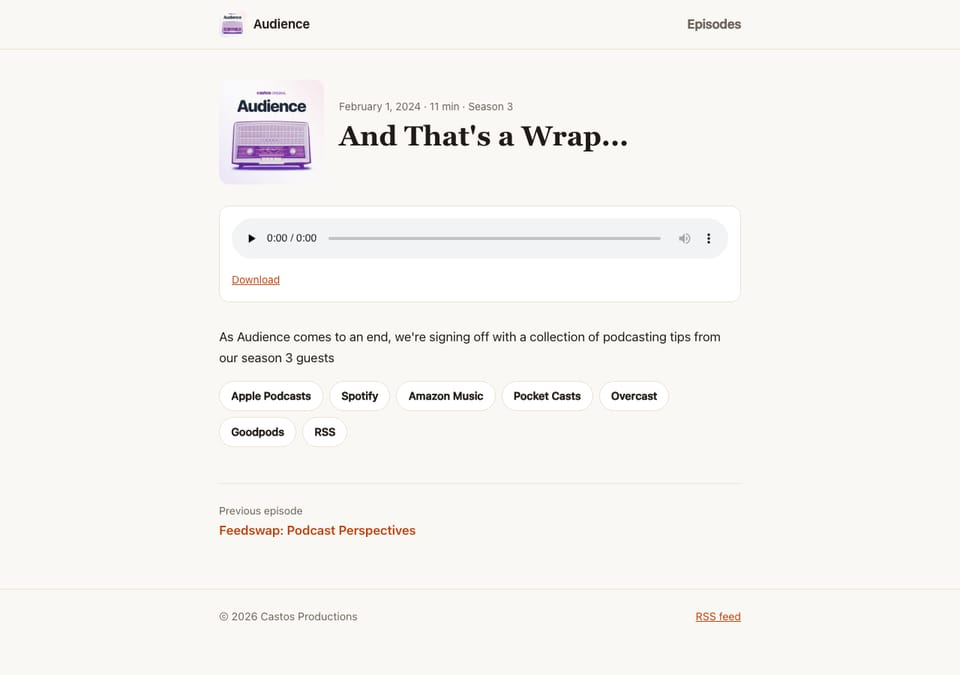
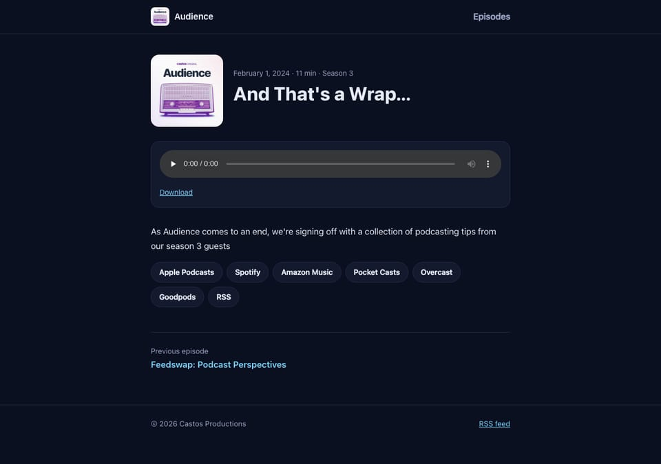
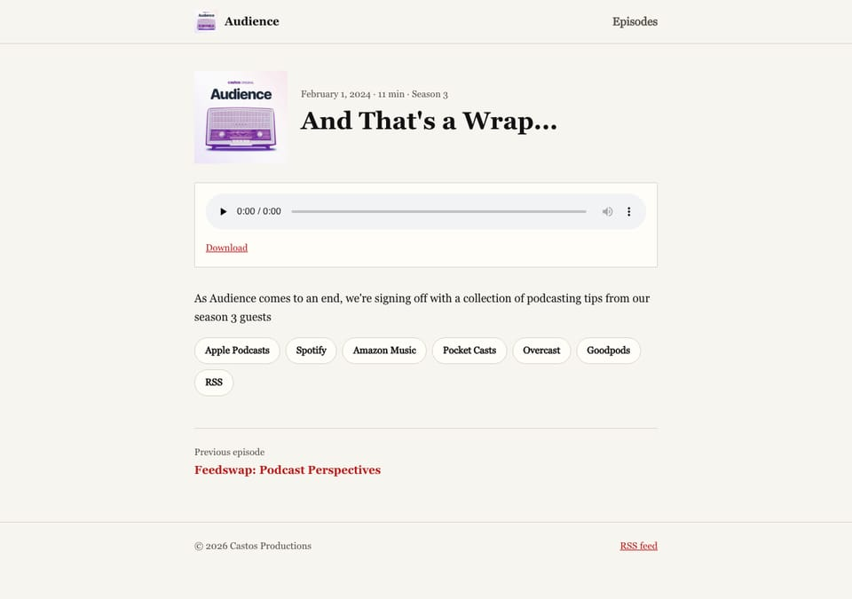
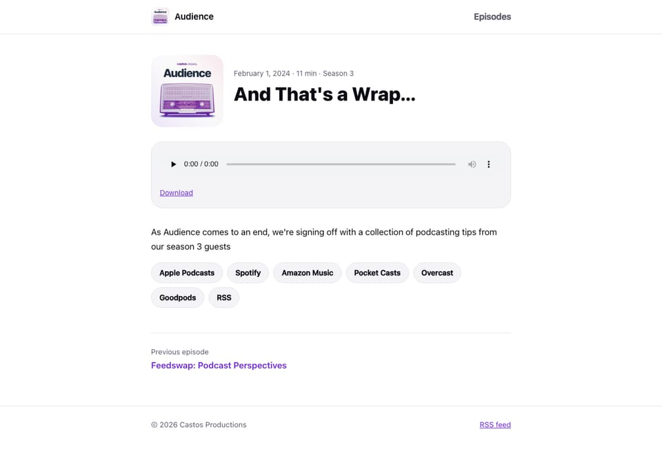

# Podcast Site Starter

A podcast website built from your RSS feed. No WordPress, no plugin, no database.

**Status:** prototype.



## Deploy in 2 steps

**Step 1.** Click a button. It copies this project to your GitHub account and deploys it.

[](https://app.netlify.com/start/deploy?repository=https://github.com/amongthestones/podcast-site-starter)
[](https://vercel.com/new/clone?repository-url=https%3A%2F%2Fgithub.com%2Famongthestones%2Fpodcast-site-starter&project-name=podcast-site&repository-name=podcast-site)
[](https://deploy.workers.cloudflare.com/?url=https://github.com/amongthestones/podcast-site-starter)

**Step 2.** Your new site shows a setup page. Follow its link to `podcast.config.json` in your repo, paste your feed URL, and commit:

```json
"feedUrl": "https://feeds.castos.com/abc12",
```

Your site rebuilds with your show and episodes in a minute or two. New episodes appear automatically after that.

**Prefer another host?** Click **Use this template** at the top of this page, add your feed URL, then import the repo on any static host. Astro is detected automatically, so there are no build settings to type.

## What you get

- A home page with your show art, description, subscribe buttons, and latest episodes
- An episode archive at `/episodes/`
- A page for every episode in your feed, with a player and show notes
- Episode URLs that match Castos-hosted websites: `yoursite.com/episodes/episode-title/`
- Subscribe buttons found automatically from your Castos website
- Podcast schema, Open Graph tags, and a sitemap for search engines
- 3 layouts and 4 styles you can mix, plus an accent color from your cover art
- A guide for AI coding agents (`AGENTS.md`), so you can ask one to restyle or extend the site

The site shows exactly the episodes your feed lists. If your host limits the feed to your latest 100 episodes, the site has 100 episode pages.

## Themes

Pick a layout and a style in `podcast.config.json`. Any layout works with any style.

```json
"layout": "grid",
"style": "midnight",
"accent": "auto",
```

### Layouts

<table>
  <tr>
    <td width="33%"></td>
    <td width="33%"></td>
    <td width="33%"></td>
  </tr>
  <tr>
    <td><code>classic</code><br>Show intro with cover art, then episode cards. The default.</td>
    <td><code>grid</code><br>Big centered cover, then a grid of episode art. Best when episodes have their own artwork.</td>
    <td><code>minimal</code><br>Text only, like a blog. Dates and titles, no images.</td>
  </tr>
</table>

### Styles

<table>
  <tr>
    <td width="50%"></td>
    <td width="50%"></td>
  </tr>
  <tr>
    <td><code>warm</code><br>Cream background, serif headings, burnt orange. The default.</td>
    <td><code>midnight</code><br>Always dark, cool blues.</td>
  </tr>
  <tr>
    <td></td>
    <td></td>
  </tr>
  <tr>
    <td><code>newsprint</code><br>Black on paper, serif type, square corners, red.</td>
    <td><code>bold</code><br>Bright white, heavy headings, round corners, violet.</td>
  </tr>
</table>

Screenshots use the [Audience](https://audience.castos.com) feed. Layouts are shown in `warm`, styles in `classic`.

Every style except `midnight` switches to dark colors when a visitor's device is in dark mode.

**Accent color:** leave `accent` empty to use the style's color. Set it to `"auto"` to pick a color from your cover art, or to a hex color like `"#0f766e"` to use your brand color. Pick a color dark enough to read on a light background.

**Compare them all:** run the site locally (see below) and open `http://localhost:4321/themes/`. It shows your own feed in every layout and style. This page only exists on your computer, never on the live site.

## Automatic updates

You don't need to set anything up. Every 4 hours, a GitHub Action checks your feed. When something changed, it commits a small file called `feed-status.json`, and your host redeploys on that commit.

**Cost:** free for public repos. Private repos use about 180 of GitHub's 2,000 free minutes a month. To check less often, edit the `cron` line in `.github/workflows/check-feed.yml`.

**Update right away:** open your repo's **Actions** tab, pick **Check feed for new episodes**, and click **Run workflow**.

### Netlify without GitHub Actions

Netlify can run the check itself instead.

1. In Netlify, go to **Project configuration > Build & deploy > Build hooks** and add a hook.
2. Go to **Environment variables** and add `BUILD_HOOK_URL` with the hook address.
3. Redeploy.
4. In GitHub, go to the **Actions** tab and disable **Check feed for new episodes**, so updates don't deploy twice.

This checks hourly and builds only when the feed changed.

## Settings

Edit `podcast.config.json` in your repo.

| Setting | What it does |
|---|---|
| `feedUrl` | Your podcast's RSS feed. Required. |
| `layout` | `classic`, `grid`, or `minimal`. See [Themes](#themes). |
| `style` | `warm`, `midnight`, `newsprint`, or `bold`. |
| `accent` | Empty for the style's color, `auto` for a color from your cover art, or a hex color. |
| `episodePath` | Folder for episode pages. Default `episodes`. |
| `slugSource` | `link` (default) takes each episode's URL from its link in the feed. `title` builds it from the title. |
| `findSubscribeLinks` | Set to `false` to stop finding subscribe links automatically. |
| `subscribeLinks` | Extra listening links. See below. |

Environment variables on your host override the file. See `.env.example`. On Cloudflare, also set `SITE_URL` to your site's address so canonical links and the sitemap work.

## Subscribe buttons

These fill in automatically. On each build, the site reads the subscribe page of your Castos-hosted website and picks up links to Apple Podcasts, Spotify, Amazon Music, Pocket Casts, Overcast, and other podcast apps.

To add a link Castos doesn't list, add it to `subscribeLinks`. The app is detected from the address, and your link replaces a found link for the same app:

```json
"subscribeLinks": ["https://www.youtube.com/@yourshow"]
```

YouTube links are never picked up automatically, because a website's YouTube link is often a social link, not the podcast.

## Keeping your old links

**Moving from a Castos-hosted website:** episode links already match (`/episodes/episode-title`). Point your domain here and old links keep working.

**Moving from WordPress with Seriously Simple Podcasting:** your old links look like `yoursite.com/podcast/episode-title/`. Set `"episodePath": "podcast"`.

Either way, open a few old episode links on the new site before you switch your domain. If they don't load, try `"slugSource": "title"`.

## Local development

```sh
npm install
cp .env.example .env    # set PODCAST_FEED_URL
npm run dev
```
